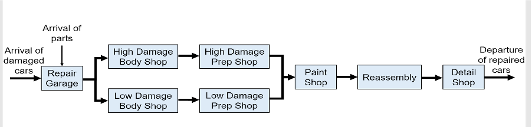
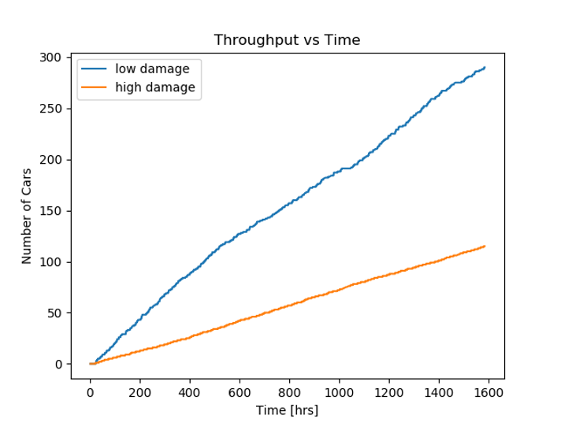
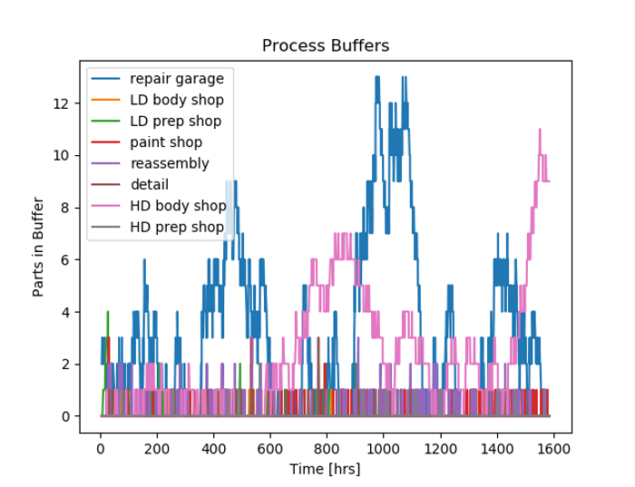
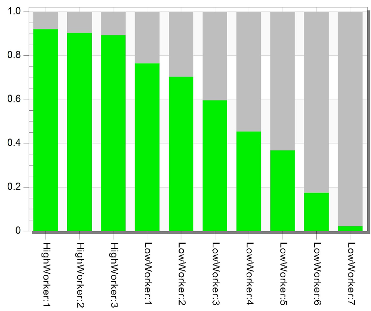

# prodsim

Production simulator for multi-process manufacturing systems.

# Overview

This is a simulator for multi-process, manufacturing systems with production of discrete parts. It simulatates arrivals of raw materials, labor processes, part throughput, buffers, and queues. 

The simulation relies on 4 classes:

- The ```Process``` class characterizes a system process. It is defined by a name, statistical distribution characterizing process cycle time or process labor time, buffer capacity, maximum parts that can be serviced simultaneously, and a maximum number of workers per part for the process (if applicable). An instance of the ```Process``` class is created for each process in a factory.
- The ```PartType``` class characterizes different parts that are produced. It is defined by a name, a statistical distribution characterizing how stock arrives for the part’s production, and a list of ```Process``` objects characterizing the process that need to be performed to produce the part. ```Process``` objects can be shared between different ```PartType``` objects. An instance of the ```PartType``` class is created for each unique part type produced in the factory.
- The ```Worker``` class characterizes different workers in the factory. It is defined by a name and a set of ```Process``` class instances that the worker has the skills to work on. An instance of the ```Worker``` class is created for every worker in the factory. 
- The ```Factory``` class encapsulates all processes, parts, and workers in the factory. It is defined with a set of ```PartType``` objects containing the unique parts that will be produced in the factory, and a set of ```Worker``` objects characterizing every worker available in the factory. 

The main logic exists in the ```Factory``` class, which has an ```update_factory()``` method that moves the production in the factory forward. It calls helper methods that add arriving parts to the initial buffer, start and end processes, move parts into new processes, and allocate workers. 

# Usage

 This simulator uses yaml configuration files to specify production parameters. See **tests** folder for example yaml files. The yaml file is supplied as a command-line argument:

```python main.py path-to-yaml-config-file```

# Case Study: Modeling an Autobody Shop

An autobody shop receives damaged cars, and repairs the cars by passing them through a series of sequential processes: repair garage, body shop, prep shop, paint shop, reassembly, and detail shop. The amount of damage to the arriving cars varies, but we assume cars can be categorized as low-damage or high-damage, and the amount of labor to repair the cars is accounted for accordingly. This workflow is shown below:



For each of these processes, a statistical labor distributions can be assigned. We use the labor distributions and other parameters provided by a published [case study](https://www.proquest.com/docview/1622299233):

| Process      | Distribution| Parameters (hours)|
| -----------  | ----------- | ----------- |
| Repair Garage| Triangular  | left: 9.4, mode: 13.5, right: 18|
| High-Damage Body Shop| Triangular  | left: 28, mode: 28, right: 60.4|
| Low-Damage Body Shop| Triangular  | left: 2.3, mode: 16.6, right: 27.1|
| High-Damage Prep Shop| Triangular  | left: 4, mode: 8, right: 30|
| Low-Damage Prep Shop| Weibull  | a: 1, scale: 1.98|
| Paint Shop | Uniform  | left: 0.45, right: 3.48|
| Detail Shop| Exponential  | scale: 0.5|

We assume an exponential process for arrival of cars, with an average arrival rate of 6.55 cars/day. It is assumed 30% of arriving cars are high-damage and 70% of cars are low-damage.

The autobody shop employs several types of workers:
- 3 workers that can work on all jobs in the shop
- 7 workers that can work on low-damage, prep, and reassembly jobs
- 4 workers that can perform estimates in the repair garage
- 2 workers that can work in the paint shop
- 2 workers than can do the detailing jobs

All of these parameters are included in a yaml configuration file. See the **tests/autobody_shop.yaml** file for this example.

After running the simulation with ```python main.py path-to-autobody_shop.yaml```, outputs can be extracted from the various objects.

For instance, shop throughput for low- and high-damage cars:



Cars waiting in buffers for repair:



Worker utilization:

